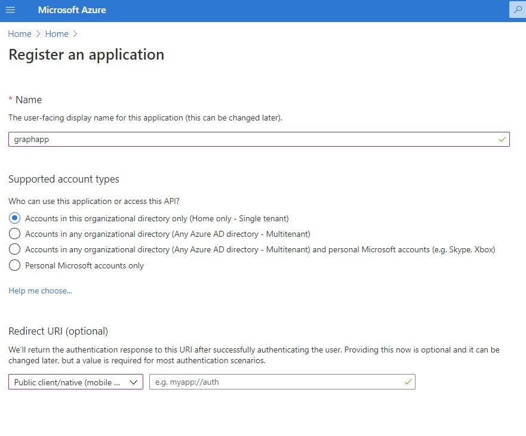
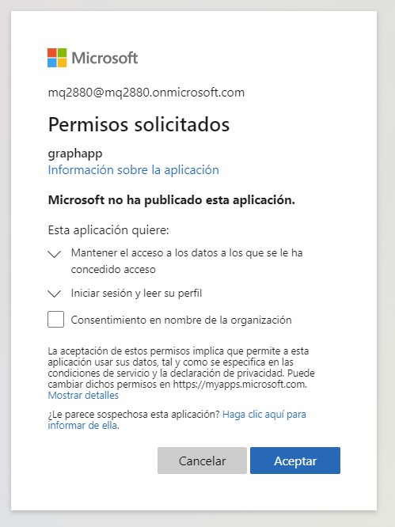
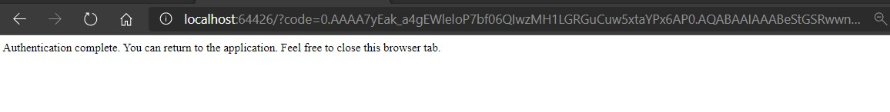
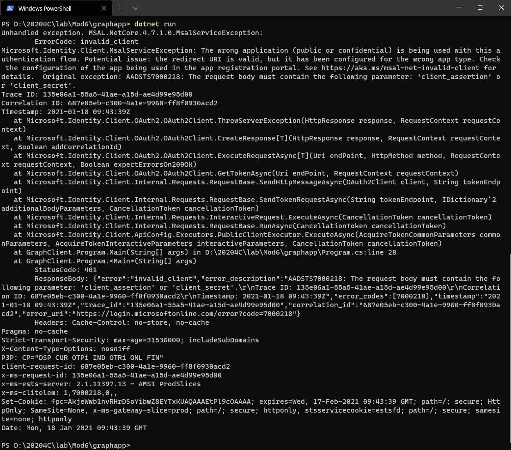
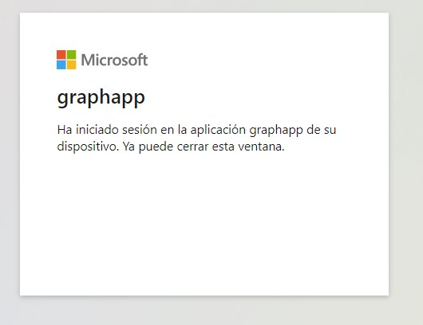
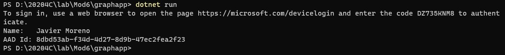

# Module 6 Implement user authentication and authorization

## Lab: Authenticating to and querying Microsoft Graph by using MSAL and .NET SDKs

1. **Nombres y apellidos:** Francisco Javier Moreno Quevedo
2. **Fecha:** 17/01/2021
3. **Resumen del Ejercicio:** Registrar en Azure una aplicacion y dar permisos
4. **Dificultad o problemas presentados y como se resolvieron:** Ninguna

#### Exercise 1: Create an Azure AD application registration

1. Crear un Registro de aplicacion

   

   #### Exercise 2: Obtain a token by using the MSAL.NET library

2. Creamos un nuevo proyectyo **GraphClient**

   

   ```
   dotnet new console --name GraphClient --output .
   ```

   > 

3. Añadimos el paquete Microsoft.Identity.Client al proyecto

   ```
   dotnet add package Microsoft.Identity.Client --version 4.7.1
   ```

   

   

4. En el **Program.cs** en el **Main** añadimos

   

   ```
   using Microsoft.Identity.Client;
   using System;
   using System.Collections.Generic;
   using System.Threading.Tasks;
   
   public class Program
   {
       private const string _clientId = "<app-reg-client-id>";
       private const string _tenantId = "<aad-tenant-id>";
       
       public static async Task Main(string[] args)
       {
           app = PublicClientApplicationBuilder
           .Create(_clientId)
           .WithAuthority(AzureCloudInstance.AzurePublic, _tenantId)
           .WithRedirectUri("http://localhost")
           .Build();
           List<string> scopes = new List<string> 
           { 
               "user.read" 
           };
           result = await app
                   .AcquireTokenInteractive(scopes)
                   .ExecuteAsync();
           Console.WriteLine($"Token:\t{result.AccessToken}");
       }
   }
   ```

5. Ejecutamos

   








### Exercise 3: Query Microsoft Graph by using the .NET SDK

1. Añadir el paquete **Microsoft.Graph** 

   ```
   dotnet add package Microsoft.Graph --version 1.21.0
   ```

1. Añadir el paquete **Microsoft.Graph.Auth** 

   ```
   dotnet add package Microsoft.Graph.Auth --version 1.0.0-preview.2
   ```

1. Compilar

   ```
   dotnet build
   ```

1.  Modificar el **Program.cs** 

1.  Añadir

```
using Microsoft.Graph;    
using Microsoft.Graph.Auth;
```

1. Comentar:

   ```
   AuthenticationResult result;
       
   result = await app
       .AcquireTokenInteractive(scopes)
       .ExecuteAsync();
   
   Console.WriteLine($"Token:\t{result.AccessToken}");
   ```

1. Añadir

   

   ```
   DeviceCodeProvider provider = new DeviceCodeProvider(app, scopes);
   GraphServiceClient client = new GraphServiceClient(provider);
   User myProfile = await client.Me
       .Request()
       .GetAsync();
   Console.WriteLine($"Name:\t{myProfile.DisplayName}");
   Console.WriteLine($"AAD Id:\t{myProfile.Id}");
   ```

3. Ejecutar






